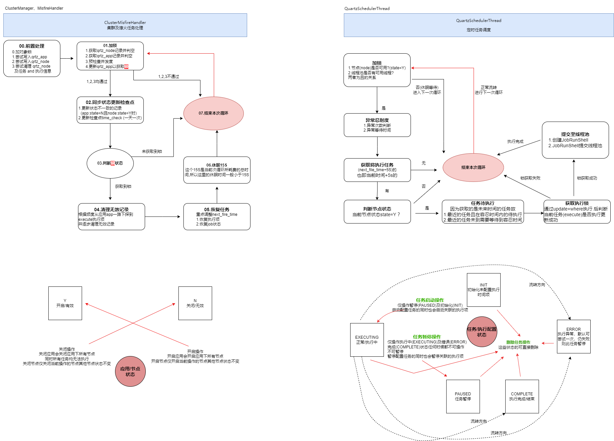

## quartz集群增强版
 
  quartz集群增强版花费了我四月有余的时间开发而来，由quartz的 2.3.2 版本改造，对原有功能进行了部分缩减，
同时也对现有的痛点做了大量的增强，这些增强包括有:

#### 1. 修改任务参数序列化及存储
  将默认参数存储方式由blob大字段方式修改为定长字符串方式，同时内部使用 `org.json` 库对json字符串序列化及反序列化，使用起来更便捷
  同时也将传参配置由原版的 K/V (Map的存储传递方式) 改为对象(eg:`{"aa":1}`)或列表(eg:`[11,true,{"bb":"her"}]`) 的方式,使用时即用
  `context.getJobDataMap()` 或 `context.getJobDataList()` 更简单快捷，同时也可通过 `context.getJobData()` 拿出原始存储的json字符串😊


#### 2. 分离了执行端及配置管理端
  这是很大的改变，如果是执行端使用，则只需添加依赖 `quartz-core`,如果是后管配置则只需要连接执行库后使用依赖 `quartz-client` 来配置，管理集群分布式的执行端也只需要
使用此来配置即可（前提是连接同一个库表）， 这在原版的quartz中是不可想想的，原版的 执行端与配置端耦合这种不太美妙的方式着实令人头疼与不解😂

#### 3. 使用乐观锁
  这同样也是重大的变化，原版采用lock表悲观锁，每次变更都要竞争同一个 `STATE_ACCESS` 或 `TRIGGER_ACCESS` ,同时每次执行加锁释放锁的时还需要配合线程本地变量来使用，看起来十分的笨重同时系统开销也比较大
  quartz集权增强版不再使用lock表悲观锁，而是使用 `update ... where ...` 方式的乐观锁，同样存在查询的开销，但是db写的开销减少不少。 
  同时，需要说明的是使用乐观锁似乎还是有些不妥，可目前并没有测试bug，如果有好的idea 恳请告知哈~ 🤦

#### 4. 简化了表结构以及数量
  由于底层去掉了trigger及memory单机等相关逻辑，表结构也做了相应的简化，由原版的11张表简化为4张表，没错，就是四张表，四张表就ok💪
  表的整体结构主要参考了 mee_timed 这个同样由我写的定时任务组件，目前 四张表有:
  + qrtz_app 应用表： 用于定义应用,尤其是对于管理分布式应用十分有用,同时执行端启动时会自动新增或更新 无需手动添加数据
  + qrtz_node 节点表：用于定义应用下的节点,这是对于集群应用十分有用,比如你需要增量发布时候可通过启停节点增量更新执行端，同样也是自动新增或更新，十分方便
  + qrtz_job 任务配置表: 配置任务的基本信息(不包含执行事件项，一个任务对应多个执行时间项)，主要定义任务的执行类以及关联的应用信息
  + qrtz_execute 执行配置表: 执行配置必须关联一个任务配置，执行配置也有独立的状态可供修改调整
  
#### 5. 去掉了`group`（组）
  这是个不太`有用`的概念,组在绝大数使用quartz组件的开发者来说十分困惑，`group`的使用如有不慎会跟预期存在差异，因为有 group 这一层的存在，管理任务也略显有些臃肿。。。🤨🤨
  去掉了 group 的同时也去掉了 TriggerKey 及相关的逻辑,这样就基本淡化了 group 的概念及使用，好处不言而喻。


#### 6. 兼容原版quartz的配置项及集成方式
  对于常用的springboot框架，集成方式于原版的quartz的方式并无太大区别，只是导入表需要 本 quartz集群增强版 提供的表即可，starter（autoconfigure）中无用的配置类及方法都做了兼容
  还有就是原有的context稍有变化，主要是去掉了TriggerKey以及增强json传值带来的变更，基本使用无任何区别~ 😅😅

#### 7. 缺火/熄火(MisfireHandler)及集群(ClusterManager)处理
  首先，这个变更也蛮大的。。。
  先说下缺火是什么，由于quartz内所有执行时间点都是通过对应类型的 Trigger 计算出来的，一旦出现不可预知的错误以及停机，则执行时间点无法向前推进，如果没有，则 fireTrigger 的任务扫描无法扫到造成任务无法重新执行，这就是缺火（Misfire），
  解释的并不好，请大神给斧正哈😂
  原版的quartz在这两块存在并发(集群) 以及全局悲观锁的存在，一旦触发 Misfire 则可能导致任务存在不可知的问题，同时 MisfireHandler、ClusterManager 为两个独立不同的任务，但使用的锁是同一把，逻辑处理就存在时效性问题
  但对于本 quartz集群增强版 就不同了😉😉， 现在我将这两招合一, 使用 ClusterMisfireHandler 来处理内部任务，同样是使用数据库锁，但是在 ClusterMisfireHandler 内部做了并发优化，以保证同一时间一个应用下只有一个节点执行
  缺火/集群 的处理~

#### 7. 其他
  + 简化了线程池的管理同时也兼容原有的 SimpleThreadPool 
  + 由于传参的变化也无需对存储参数的大字段的操作做各个厂商的数据库的兼容
  + 

### 架构设计


### 目前可能存在及已知的问题
 + 不管是 ClusterMisfireHandler 维护集群及缺火，还是 QuartzSchedulerThread 扫任务 都是按频度来的，其中 QuartzSchedulerThread 是5s一次循环 ，ClusterMisfireHandler 则是15s一次循环，这样问题就来了
  - 添加任务时，若您是10点整添加的任务则任务最快也得10点过5s后才可执行，这是目前 任务扫描的频度及当前架构而为之的
  - QuartzSchedulerThread 在扫描批次任务后不断循环以到执行时间点时，若关闭节点及应用也只有等当前次执行完成后才会停止任务
 + QuartzSchedulerThread 的锁的处理（集群环境下如何保证一个任务只被一个节点执行）可能存在缺陷，但目前排查不出问题，这需要使用者花时间测试以排查根本原有
 + 去掉 group 对于 group 的使用者来说这是不好的消息，这算一个吧😂
 + 目前仅支持 postgresql、mysql、oracle 这三个厂商的数据库支持，并经过测试通过，这是使用限制
 + client sdk (`quartz-client`) 虽已经过测试通过，可能存在未知bug及设计缺陷
 + 

### 待办任务
+ 移除qrtz_job::job_idx字段 ✔
+ 移除qrtz_execute::execute_idx字段 ✔
+ 移除/优化 JobDetail::getKey() job_id#execute_id#job_class#job_type ✔
+ 优化 JobRunShell:initialize() 参数组织  ✔
+ 去掉所有builder ✔
+ 去掉 qrtz_job_cfg 及 qrtz_execute_cfg 相关代码 ✔
+ 去掉 Calendar 相关代码,仅保留Calendar本身  ✔
+ 添加json序列化及反序列化操作 ✔
+ 去掉顯示的鎖處理 ✔
+ 兼容mysql及oracle數據庫 ✔
+ 啓動時自動獲取數據庫類型 ?
+ ResultSet 关闭处理 ✔
+ dsName 成员变量相关逻辑梳理 ?
+ 


## use in maven

+ core
```
<dependency>
    <groupId>io.github.funnyzpc</groupId>
    <artifactId>quartz-core</artifactId>
    <version>2.3.2</version>
</dependency>
```

+ client sdk
```
<dependency>
    <groupId>io.github.funnyzpc</groupId>
    <artifactId>quartz-client</artifactId>
    <version>2.3.2</version>
</dependency>
```
